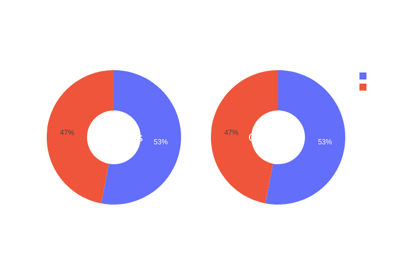
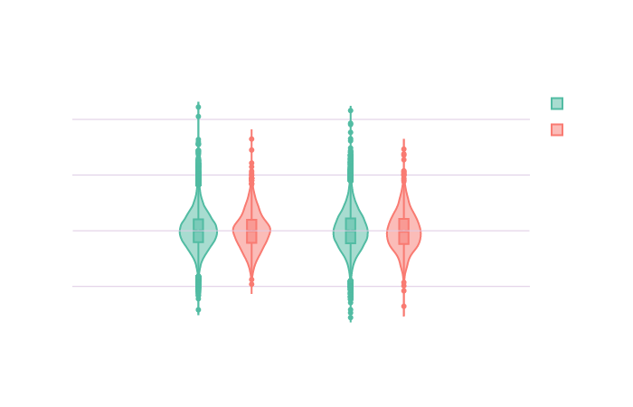

# BLUP: BRAIN LEARNING UNICORN PROJECT

### ***Can a model predict the genetic profile of an individual based on brain regions volumes?***

<ins>Author:</ins> Elise Alix Douard

<ins>Other project contributors:</ins>
BHS, Hannah Kiesow [@hannahmaykiesow](https://twitter.com/hannahmaykiesow) (also working on UKBiobank), Kuldeep Kumar [@meetkd007](https://twitter.com/meetkd007) (extracting data from UKBB servers)

This Github page is the final product for the week 3 deliverable related to the data visualization. 

# BACKGROUND

<p align="center">
  
</p>

<p> <font size="1">Source: Illustration inspired from freepik.com content and adapted on adobe illustrator</font></p> 

Copy number variants (CNVs) are a family of structural variation of the chromosomes. They can be either a gain or a loss of a chromosome portion in comparission to a genome of reference. 

Sometimes, CNVs can be pathogenic, meaning that they are formally associated to neurodevelopmental or psychiatric disorders, such as autism spectrum disorders (ASD), Schizophrenia (SZ) or intellectual disability (ID). 

Such pathogenic CNVs have been associated to significant alterations of brain volume (Modenato et al., ; [Martin-Brevet et al., 2018](http://www.sciencedirect.com/science/article/pii/S000632231831401X) ; [Maillard et al., 2015](https://www.nature.com/articles/mp2014145)) or connectivity ([Moreau et al., 2019](https://www.biorxiv.org/content/10.1101/862615v1.full)). 

Notably, there were common alterations of the insula volume when comparing structural brain alterations due to pathogenic CNVs and due to a neurodevelopmental disorder (e.g. ASD or SZ) (). 

# AIM OF THE PROJECT

<p align="center">
  
</p>

<p> <font size="1">Source: Illustration inspired from freepik.com content and adapted on adobe illustrator</font></p> 

- Main goal: 

This project aims to feed a machine learning model with brain volumes to predict if an individual is carrier of a potentially pathogenic CNV.

- Personal goals: 

- [x] Learn how to python
- [x] Learn how to machine learning
- [x] Learn how to interactive plot

# METHOD

## Raw data

For this project, 35,759 individuals from [UK Biobank](https://www.ukbiobank.ac.uk/) with genetic and derived brain volume data were available.
- 1,265 individuals were carriers of at least one of 93 potentially pathogenic genetic variants identified by [Kendal et al. (2019)](https://www.cambridge.org/core/journals/the-british-journal-of-psychiatry/article/cognitive-performance-and-functional-outcomes-of-carriers-of-pathogenic-copy-number-variants-analysis-of-the-uk-biobank/0D144F6880A46DC94EE27ADEACB5942B).
- All individuals have derived-brain volumes preprocessed on Freesurfer using Desikan parcellation (68 regions) [[cf. documentation for processing pipeline details](https://biobank.ctsu.ox.ac.uk/crystal/crystal/docs/brain_mri.pdf)].

Click on the following image to open the interactive 3D Desikan atlas.

<p align="center">
<a href="blog_content/DesikanLeftParcellation_lh.html"></a>
</p>

Here is the code used to create the 3D map of the left brain Desikan parcellation (34 regions). 

```python
# reading the .annot file from freesurfer
from nibabel.freesurfer.io import read_annot

# Import a template of Freesurfer processed left hemisphere based on Desikan atlas to create the ROI map
annotation_path_lh = "free_surfer_parcellation/lh.aparc.annot"
annotation_lh = read_annot(annotation_path_lh)

ROI_map_lh = annotation_lh[0]

# plot the parcellation map
from nilearn import datasets, plotting 

fsaverage5 = datasets.fetch_surf_fsaverage(mesh='fsaverage', data_dir=None)
fig0_lh = plotting.view_surf(fsaverage5.infl_left, ROI_map_lh, cmap = "gist_ncar", symmetric_cmap=True,
                         colorbar = False, 
                         title = "Desikan atlas of the left hemisphere" )

# Creating the html file 
fig0_lh.save_as_html("blog_content/DesikanLeftParcellation.html")

```

## Confounders

Volumes were corrected for the potential effect of the following confounders: 

- [x] age
- [x] Total intracranial volume (TIV)
- [x] sex
- [x] site of acquisition 

**Table 1:** Demographic data

| Goup | N | Mean age (sd) | Mean TIV (sd) | N Female | N Male | N Site 1 | N Site 2 | N Site 3 |
|:------|:-----:|:---------:|:------:|:---------:|:---------:|:---------:|:---------:|:---------:|
|   Carriers  | 1265  |63.8 (7.4)| 1540824.3 (150493.6) | 671 | 594 | 781 | 320 | 164 |
|  Controls  | 34494 | 64.1	(7.6) | 1549091.7 (151512.6) | 18280 |	16214 |	21411 | 8607 |	4476 |

Let's create an overview of the distribution of these confounders in the sample.

Click on the following images to open the interactive violin plots showing the age and TIV distributions in function of the groups.

<p align="center">
<a href="blog_content/violin_ageTIV.html"></a>
</p>

<p align="center">
<a href="blog_content/violin_ageTIV.html"></a>
</p>

Code used to create violin plots of age and TIV with the widget function in Plotly:

```python
# Loading plotly and widget libraries
import plotly.graph_objects as go
from ipywidgets import widgets, IntSlider
from ipywidgets.embed import embed_minimal_html

# Assign the default figure widget with two traces
fig1 = go.FigureWidget()
confounder1 = widgets.Dropdown(
    options=list(df_plot1['variable'].unique()),
    value='age',
    description='Confounders used for the volumes correction:',)

fig1.add_shape(
        # Line Horizontal
            type="line",
            x0=-1,
            y0=0,
            x1=2,
            y1=0,
            line=dict(
                color='rgb(222,203,228)',
                width=2,
            ),
    )

fig1.add_trace(go.Violin(x=df_plot1['group'][(df_plot1['group'] == 'control') & 
                                                  (df_plot1.variable== "age")],
                        y=df_plot1["value"][(df_plot1['group'] == 'control') & 
                                                  (df_plot1.variable== "age")],
                        legendgroup='controls', scalegroup='controls', name='Controls',
                        line_color= "rgb(82,188,163)", box_visible=True, meanline_visible=True)
              )
fig1.add_trace(go.Violin(x=df_plot1['group'][(df_plot1['group'] == 'carrier') & 
                                                  (df_plot1.variable== "age")],
                        y=df_plot1["value"][(df_plot1['group'] == 'carrier') & 
                                                  (df_plot1.variable== "age")],
                        legendgroup='carriers', scalegroup='carriers', name='Carriers',
                        line_color="rgb(249,123,114)", box_visible=True, meanline_visible=True)
               )


fig1.update_layout(paper_bgcolor='rgba(0,0,0,0)',
                   plot_bgcolor='rgba(0,0,0,0)', 
                   title = 'Distribution of the confounders from UKBioBank controls and carriers'
                  )
fig1.layout.yaxis.range = [0,max(df_plot1["value"][(df_plot1['group'] == 'control') & 
                                                  (df_plot1.variable== "age")])]
fig1.layout.yaxis.gridcolor = 'rgb(222,203,228)'
fig1.layout.yaxis.title = "age"

def response(change):
        temp_df = df_plot1[df_plot1.variable == confounder1.value]

        x1 = temp_df['group'][(temp_df['group'] == 'control')]
        x2 = temp_df['group'][(temp_df['group'] == 'carrier')]
        y1 = temp_df["value"][(temp_df['group'] == 'control')]
        y2 = temp_df["value"][(temp_df['group'] == 'carrier')]
        with fig1.batch_update():
            fig1.data[0].x = x1
            fig1.data[0].y = y1
            fig1.data[1].x = x2
            fig1.data[1].y = y2
            fig1.layout.yaxis.range = [0,max(temp_df["value"])]
            fig1.layout.yaxis.gridcolor = 'rgb(222,203,228)'
            fig1.layout.yaxis.title = confounder1.value
            
confounder1.observe(response, names="value")
widgets.VBox([confounder1, fig1])

# Save as html
embed_minimal_html('blog_content/violin_ageTIV.html', views=[widgets.VBox([confounder1, fig1])])
```

Click on the following images to open interactive pie-charts showing the sex and site of aquisition distributions in function of the groups.

<p align="center">
<a href="blog_content/piechart_sex.html"></a>
</p>

<p align="center">
<a href="blog_content/piechart_site.html"></a>
</p>

Code used to create pie-charts of sex and sites of acquisition with the widget function in Plotly:

```python
# Loading plotly and widget libraries
import plotly.graph_objects as go
from plotly.subplots import make_subplots
from ipywidgets import widgets, IntSlider
from ipywidgets.embed import embed_minimal_html

specs = [[{'type':'domain'}, {'type':'domain'}]]
fig2 = make_subplots(rows=1, cols=2, specs=specs)
fig2 = go.FigureWidget(fig2)

fig2.add_trace(go.Pie(labels=df_plot2["variable"][(df_plot2['Group'] == 'control') &
                                              (df_plot2["confounder"] == "Sex")], 
                      values=df_plot2["value"][(df_plot2['Group'] == 'control') &
                                              (df_plot2["confounder"] == "Sex")], 
                      name='Controls',), 1,1,
              )

fig2.add_trace(go.Pie(labels=df_plot2["variable"][(df_plot2['Group'] == 'carrier') &
                                              (df_plot2["confounder"] == "Sex")], 
                      values=df_plot2["value"][(df_plot2['Group'] == 'carrier') &
                                              (df_plot2["confounder"] == "Sex")], 
                      name='Carriers',), 1, 2,
              )

fig2.update_traces(hole=.4)
fig2.update_layout(paper_bgcolor='rgba(0,0,0,0)',
                   plot_bgcolor='rgba(0,0,0,0)',legend_title_text="Sex",
    title_text="Proportions of individuals by sex or acquisition site in function of the group",
    # Add annotations in the center of the donut pies.
    annotations=[dict(text='Controls', x=0.17, y=0.5, font_size=20, showarrow=False),
                 dict(text='Carriers', x=0.82, y=0.5, font_size=20, showarrow=False)]
    )

confounder2 = widgets.Dropdown(
    options=list(df_plot2['confounder'].unique()),
    value='Sex',
    description='Confounders used for the volumes correction:',)

def response(change):
        temp_df = df_plot2[df_plot2.confounder == confounder2.value]

        x1 = temp_df['variable'][(temp_df['Group'] == 'control')]
        x2 = temp_df['variable'][(temp_df['Group'] == 'carrier')]
        y1 = temp_df["value"][(temp_df['Group'] == 'control')]
        y2 = temp_df["value"][(temp_df['Group'] == 'carrier')]
        with fig2.batch_update():
            fig2.data[0].labels = x1
            fig2.data[0].values = y1
            fig2.data[1].labels = x2
            fig2.data[1].values = y2
            fig2.update_traces(hole=.4)
            fig2.update_layout(legend_title_text=confounder2.value)     

confounder2.observe(response, names="value")

widgets.VBox([confounder2, fig2])

# Save as html
embed_minimal_html('Interactive_plots/piechart_sexsite.html', views=[widgets.VBox([confounder2, fig2])])
```

## Final brain volumes

Once volumes are corrected for the confounders, we have the choice to z-scored them. The interest of the project was also to make minimal changes to the features used in the machine learning model. The final volumes will be the ones adjusted for the confounder effects without z-scoring. 

Click on the following image to open the interactive violin plots showing the volumes distributions in function of the region of the brain, the transformation applied to the volumes and the groups.

<p align="center">
<a href="blog_content/violin_regions.html"></a>
</p>

Code used to create violin plots of the volumes in function of the region and the group with the widget function in Plotly:

```python
# Loading plotly and widget libraries
import plotly.graph_objects as go
from ipywidgets import widgets, IntSlider
from ipywidgets.embed import embed_minimal_html

# Assign the default figure widget with two traces
fig4 = go.FigureWidget()

# Choices 1: Rescale with TIV only or also with z-score
transform = widgets.Dropdown(
    options=list(df_plots['transformation'].unique()),
    value='confounds removed',
    description='Transformation applied to the volumes:',
)

# Choices 2: Chose the region of interest
region = widgets.Dropdown(
    options=list(df_plots['region'].unique()),
    value='insula',
    description='Region of interest:',
)

fig4.add_shape(
        # Line Horizontal
            type="line",
            x0=-1,
            y0=0,
            x1=2,
            y1=0,
            line=dict(
                color='rgb(222,203,228)',
                width=1,
            ),
    )

# Create the violin plots with the default values
fig4.add_trace(go.Violin(x=df_plots['hemisphere'][(df_plots['group'] == 'control') & 
                                                  (df_plots.transformation== "confounds removed") & 
                                                  (df_plots['region'] == 'insula')],
                        y=df_plots["value"][(df_plots['group'] == 'control') & 
                                                  (df_plots.transformation== "confounds removed") & 
                                                  (df_plots['region'] == 'insula')],
                        legendgroup='controls', scalegroup='controls', name='Controls',
                        line_color="rgb(82,188,163)", box_visible=True, meanline_visible=True)
             )
fig4.add_trace(go.Violin(x=df_plots['hemisphere'][(df_plots['group'] == 'carrier') & 
                                                  (df_plots.transformation== "confounds removed") & 
                                                  (df_plots['region'] == 'insula')],
                        y=df_plots["value"][(df_plots['group'] == 'carrier') & 
                                                  (df_plots.transformation== "confounds removed") & 
                                                  (df_plots['region'] == 'insula')],
                        legendgroup='carriers', scalegroup='carriers', name='Carriers',
                        line_color="rgb(249,123,114)", box_visible=True, meanline_visible=True)
             )

fig4.update_layout(violinmode='group',
                   paper_bgcolor='rgba(0,0,0,0)',
                   plot_bgcolor='rgba(0,0,0,0)', 
                  title = 'Distribution of the brain region volumes from UKBioBank controls and carriers')
fig4.layout.xaxis.title = 'Hemisphere'
fig4.layout.yaxis.title = 'Volume'
fig4.layout.yaxis.gridcolor = 'rgb(222,203,228)'

# Add the conditions for the widget entry and refresh the plots
def response(change):
        filter_list = [i and j for i, j in
                           zip(df_plots['region'] == region.value,
                               df_plots['transformation'] == transform.value)]
        temp_df = df_plots[filter_list]

        x1 = temp_df['hemisphere'][(temp_df['group'] == 'control')]
        x2 = temp_df['hemisphere'][(temp_df['group'] == 'carrier')]
        y1 = temp_df["value"][(temp_df['group'] == 'control')]
        y2 = temp_df["value"][(temp_df['group'] == 'carrier')]
        with fig4.batch_update():
            fig4.data[0].x = x1
            fig4.data[0].y = y1
            fig4.data[1].x = x2
            fig4.data[1].y = y2
            fig4.update_layout(violinmode='group')


region.observe(response, names="value")
transform.observe(response, names="value")

container = widgets.HBox([region, transform])
widgets.VBox([container, fig4])

# Save as html
embed_minimal_html('Interactive_plots/violin_regions.html', views=[widgets.VBox([container, fig4])])

```

## Training set and test set

